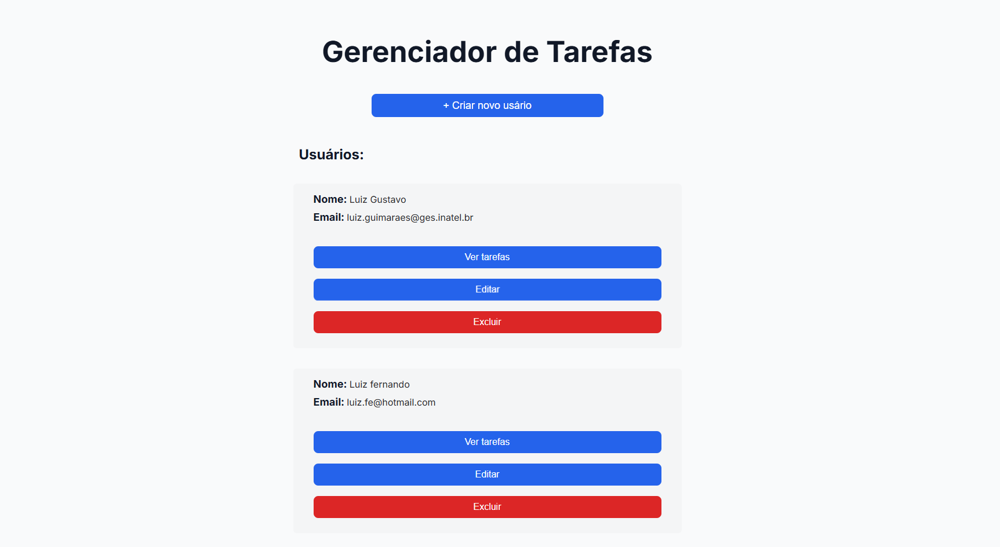
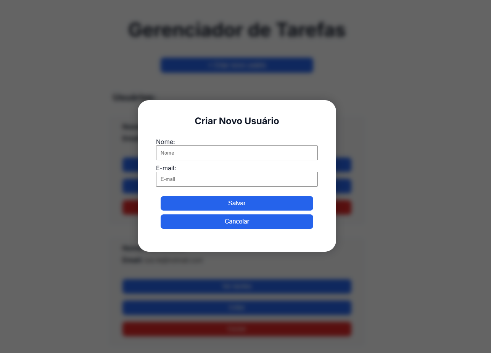
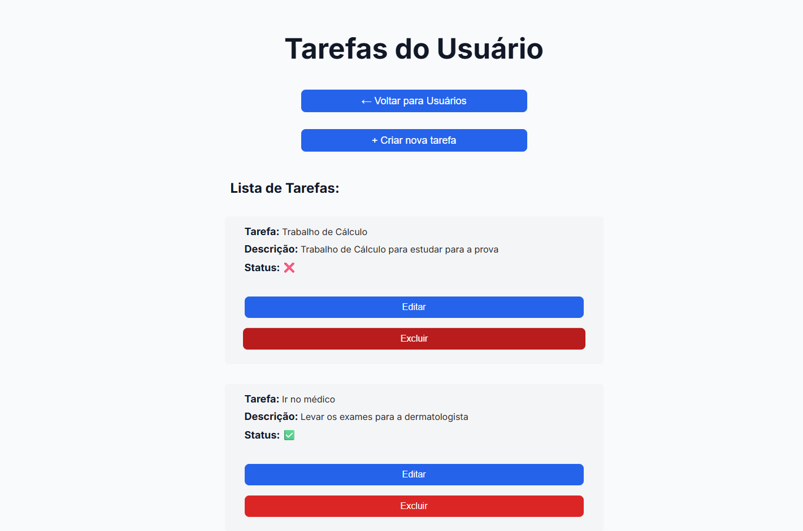
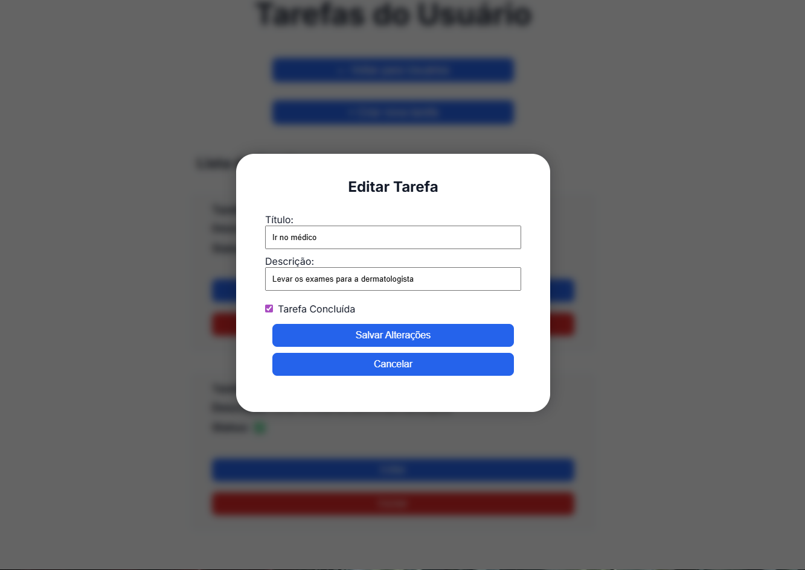

# Prova Técnica – Inatel

Este repositório foi criado para armazenar um projeto feito para avaliação técnica.

---

## 📌 Descrição do Projeto

O projeto consiste em uma **API REST para gerenciamento de tarefas de usuários**.

Cada usuário pode ter várias tarefas (relacionamento **1:N**), e o sistema permite realizar as operações básicas de um CRUD:

- Criar usuários
- Listar usuários
- Atualizar usuários
- Deletar usuários
- Criar tarefas
- Listar tarefas
- Atualizar tarefas
- Deletar tarefas

O frontend consome os dados da API.

---

## 🛠️ Tecnologias Utilizadas

### Backend

- Python
- Flask
- SQLAlchemy
- Banco de dados relacional (SQLite)

### Frontend

- HTML
- CSS
- JavaScript

---

## 🚀 Como Rodar o Projeto

### 1️⃣ Clonar o Repositório

```bash
git clone https://github.com/seu-usuario/Prova-tecnica-Inatel.git
```

---

## ⚙️ Rodando o Backend (API)

### 2️⃣ Acessar a pasta do backend

```bash
cd backend
```

---

### 3️⃣ Criar o ambiente virtual

```bash
python -m venv venv
```

---

### 4️⃣ Ativar o ambiente virtual

**Windows**

```bash
venv\Scripts\activate
```

**Linux / macOS**

```bash
source venv/bin/activate
```

---

### 5️⃣ Instalar as dependências do projeto

```bash
pip install -r requirements.txt
```

---

### 6️⃣ Configurar o banco de dados

Entre no flask shell:

```bash
flask shell
```

Crie o banco de dados:

```bash
db.create_all()
db.session.commit()
exit()
```

---

### 7️⃣ Rodar a API

Com o ambiente virtual ativo, execute:

```bash
python app.py
```

Após iniciar, a API estará disponível em:

```
http://localhost:5000
```

A API pode ser testada utilizando o navegador ou ferramentas como **Postman** ou **Insomnia**.

---

## 🌐 Rodando o Frontend

### 8️⃣ Executar o Live Server

1. Instale a extensão **Live Server** no VS Code (caso ainda não tenha).
2. No explorador de arquivos, localize o arquivo `index.html`.
3. Clique com o botão direito no `index.html`.
4. Selecione **Open with Live Server**.

Após iniciar, o frontend estará disponível em:

```
http://localhost:5500
```

Certifique-se de que a API está rodando em:

```
http://localhost:5000
```

## 📸 Screenshots

### 👤 Usuários




### ✅ Tarefas



